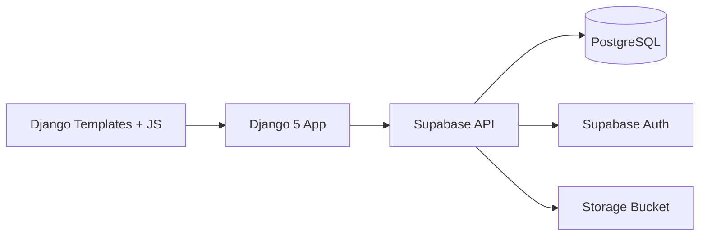

# 2. System Architecture

## 2.1 High-level diagram

## 2.2 Django apps

| App | Responsibility |
|-----|----------------|
| `accounts` | Register, login, profile, JWT session |
| `products` | Shop, detail, staff `/manage/` CRUD |
| `cart` | Session cart, AJAX add/update/remove |
| `orders` | Checkout, order history |
| `common` | Shared validators & error messages |

## 2.3 Authentication flow

1. User submits login/register form  
2. Django calls Supabase Auth REST API  
3. Access token stored in Django session  
4. `SupabaseAuthMiddleware` validates token on each request  
5. PostgREST calls use the user JWT for RLS  

_[Add your own diagram or screenshot of the login flow.]_

## 2.4 Project structure

_[Paste or summarize the folder tree from README.md.]_
