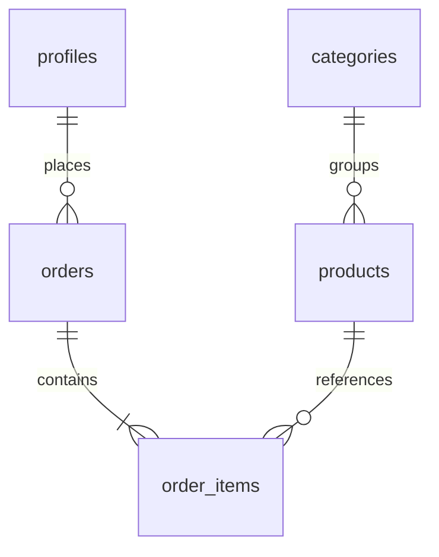

# 3. Database Design & Security (RLS)

## 3.1 Tables

| Table | Purpose |
|-------|---------|
| `profiles` | User profile + `is_staff` flag |
| `categories` | Men / Women / Kids |
| `products` | Catalog items |
| `orders` | Checkout orders |
| `order_items` | Line items per order |

## 3.2 Entity relationship (summary)

## 3.3 RLS policies (Phase 6)

| Table | anon | authenticated (customer) | staff |
|-------|------|---------------------------|-------|
| `categories` | SELECT | SELECT | SELECT |
| `products` | SELECT | SELECT | INSERT/UPDATE/DELETE |
| `orders` | — | own rows only | own rows |
| `order_items` | — | own orders only | own orders |
| `profiles` | — | own row; cannot set `is_staff=true` | own row |

**SQL script:** `supabase/phase6_rls_security.sql`

## 3.4 Stock decrement on checkout

Customers must not update arbitrary product fields. Checkout calls:

`decrement_product_stock(product_id, quantity)` — `SECURITY DEFINER` function.

## 3.5 Storage

- Bucket: `product-images` (public read)
- Staff upload policy tied to `profiles.is_staff`

_[Screenshot: Supabase → Authentication → Policies or SQL Editor results from `phase6_verify.sql`]_
